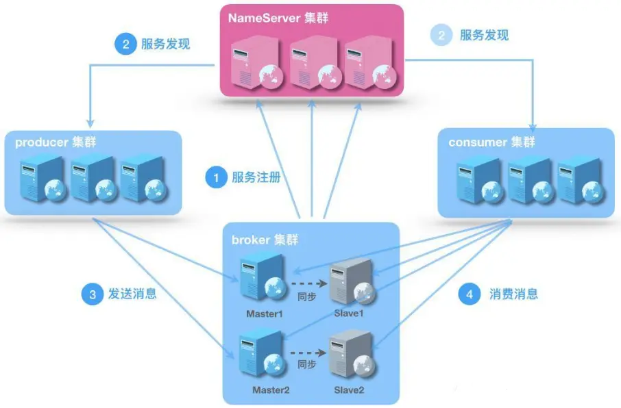

## RocketMQ


### 消息队列介绍

消息队列是《数据结构》中先进先出的一种数据结构，在当前的架构中，作为中间件提供服务。

### 消息中间件功能

#### 应用解耦

AB应用不在互相依赖

#### 流量削峰

流量达到高峰的时候，通常使用限流算法来控制流量涌入系统，避免系统被击瘫，但是这种方式损失了一部分请求

此时可以使用消息中间件来缓冲大量的请求，匀速消费，当消息队列中堆积消息过多时，我们可以动态上线增加消费端，来保证不丢失重要请求。

#### 大数据处理

消息中间件可以把各个模块中产生的管理员操作日志、用户行为、系统状态等数据文件作为消息收集到主题中

数据使用方可以订阅自己感兴趣的数据内容互不影响，进行消费

#### 异构系统

跨语言


### RocketMQ 角色




#### NameServer

底层基于netty实现，主要用于收集`broker`、`producer`和`consumer`的信息，类似于一个注册中心。再整个架构中，相当于一个管理者，其他角色需要定时向`nameServer`上报自己的状态，以便于通过`nameServer`相互发现找到对方，当获取不到上报信息后，将会进行对其剔除。

`nameServer`可以以集群的形式进行运行，其他角色会同时向他们上报信息，保证高可用。**一个`nameServer`集群是无状态的内部的，节点之间是不会相互感知的，他们都是独立运行的个体，没有主备的概念**。每一个节点上的信息都是一样的，功能也是一样的。

当`producer`、`consumer`和`brocker`上线后，会往`nameServer`进行汇报信息，保存这些角色的节点信息，默认情况下是将信息保存在内存中，并不会去保存到文件或者是数据库中，这样的好处的简单、便捷、快。

**`nameServer`不保证数据一致性，属于AP定理**。


#### Producer

- 消息的生产者
- 先通过`NameServer`集群中的其中一个节点（随机选择）建立长连接，获得`Topic`的路由信息，包括`Topic`下面有哪些`Queue`，这些`Queue`分布在哪些`Broker`上等。
- 拿到信息之后，接下来变成`Producer`与`Broker`建立长连接，向提供`Topic`服务的`Master`建立长连接，且定时向`Master`发送心跳


#### Consumer

消息的消费者，通过`NameServer`集群获得`Topic`的路由信息，连接到对应的`Broker`上消费消息。

**注意，由于`Master`和`Slave`都可以读取消息，因此`Consumer`会与`Master`和`Slave`都建立连接。**


#### Broker

- `Broker`面向`producer`和`consumer`接受和发送消息
- 向`nameserver`提交自己的信息
- 是消息中间件的消息存储、转发服务器。
- 每个`Broker`节点，在启动时，都会遍历存在于`broker`节点中的`NameServer`列表，与每个`NameServer`建立长连接，注册自己的信息，之后定时上报。

#### Broker集群

- `Broker`高可用，可以配成`Master/Slave`结构，`Master`可写可读，`Slave`只可以读，`Master`将写入的数据同步给`Slave`。
  - 一个`Master`可以对应多个`Slave`，但是一个`Slave`只能对应一个Master
  - `Master`与`Slave`的对应关系通过指定相同的`BrokerName`，不同的`BrokerId`来定义。
  - `BrokerId`为0表示`Master`，非0表示`Slave`
- Master多机负载，可以部署多个`broker`
  - 每个`Broker`与`nameserver`集群中的所有节点建立长连接，定时注册Topic信息到所有`nameserver`。
- 对于在`Consumer`中，`Consumer`在连接的时候，可以连接`Master或者Slave`，但是只能连接一个。
- 对于`Producer`中，创建消息的时候，只能连接`Brocker`的`Master`节点，而且只能连接一个`Master`节点。


#### Topic和Queue

`Topic`是一个逻辑上的概念，实际上`Message`是在每个`Broker`上以`Queue`的形式记录。


### 消息

#### 创建消息

使用`Message`类进行创建一条消息

``` java
String body = "{\"id\": \"1\", \"name\": \"张三\"}";
Message message = new Message(topic, body.getBytes());

public Message(String topic, String tags, String keys, int flag, byte[] body, boolean waitStoreMsgOK) {}
```

在`Message`类的构造方法中最多有6个参数，每一个参数具体含义如下

**topic：**用于声明当前消息是哪一个`topic`下的

**tags：**标识字段，可以用于在消费者端进行对消息的过滤消费

``` java
// 生产者端什么消息的tag标识
Message message = new Message(topic,"TAG-A", body.getBytes());
// 消费者端根据topic和tag订阅消息 多个可以使用 || 进行拼接 * 代表所有的，即不进行过滤
consumer.subscribe(topic, "TAG-A||TAG-B");
```

**keys：**用于查找消息

##### 添加附加属性

在大数据场景中，一个消息中间件可能会同时存在几百万条消息，并且还是源源不断的创造着新的消息，为此仅仅通过`TAG`的标识的方式想要进行很精确的数据分析是很难做到的，对此可以给消息添加自定义属性的形式，结合消费者的`messageSqlSelector`的机制，可以精确挑选出符合条件的消息

**开启支持sql查询**

默认在配置文件中是没有将该属性进行启用的，需要在`broker.conf `中添加配置

``` conf
# 开启属性过滤器
enablePropertyFilter=true

# 启动时指定加载配置文件启动
./mqbroker -n 127.0.0.1:9876 -c ..\conf\broker.conf
```

**设置自定义属性**

``` java
Message message = new Message(topic,"TAG-A","KEY-A", body.getBytes());

// 通过设置消息属性 可用于在超大量数据中 在消费者端通过 sql这种高度灵活的过滤方式精确获取数据
message.putUserProperty("id", String.valueOf(i));

producer.send(message);
```


**消费者使用sql过滤器**

``` java
// 可以编写简单的sql 属性和属性值就是我们在消息中添加的自定义属性
MessageSelector messageSqlSelector = MessageSelector.bySql("id >= 50 and id <= 65");
pushConsumer.subscribe(testTopic,  messageSqlSelector);
```


#### 消息消费模式

不同于RabbitMQ的路由的概念，在RocketMQ中，消息的消费模式只有两种`广播`和`集群`，**默认是集群模式**，而且定义是那种模式需要在消费者端进行声明。

##### 集群消息

集群消息可以理解为集群化部署消费者，在一个集群里面有很多组的consumer，在这个集群里面，只要有任意一个consumer能消费这条消息就行了

**特点：**

1. 每条消息只需要被处理一次，`broker`只会把消息发送个消费者集群中的一个消费者，让其进行正常消费。
2. 当出现第一次投送的消费者不能成功消费消息的时候，在消息进行重投的时候，此时可能会将该消息投送给集群中其他的消费者
3. 消息的消费的状态是由`broker`进行维护的

```java
// 默认集群模式
pushConsumer.setMessageModel(MessageModel.CLUSTERING);
// 广播模式
pushConsumer.setMessageModel(MessageModel.BROADCASTING);
```


##### 广播消息

当使用广播消费模式时，MQ 会将每条消息推送给集群内所有注册过的客户端，保证消息至少被每台机器消费一次。

**特点：**

- 消费进度由consumer维护
- 保证每个消费者消费一次消息
- 消费失败的消息不会重投

**注意：在使用中，要避免订阅相同的topic的不同消费者使用不一致的消息模式**

----------------------------

#### 消息发送方式

##### 同步消息

``` java
private static void simpleSend(String topic, DefaultMQProducer producer) throws Exception {
    // 3、发送消息
    // 3、1 声明消息的topic，实际上就是等于确定你这条消息要发给谁
    String body = "{\"id\": \"1\", \"name\": \"张三\"}";
    Message message = new Message(topic,"TAG-A","KEY-A", body.getBytes());

    // 同步消息发送 会等待broker返回执行结果 否则会一直阻塞住 不会往下走
    SendResult sendResult = producer.send(message);

    // 发送完成后 返回发送结果
    System.out.println("sendResult: " + sendResult.toString());

    // 关闭生产者 如果不关闭 进程会一直存在 默认是会一直建立长连接
    producer.shutdown();
    System.out.println("============  消息投递完成  ============");
}
```


##### 异步消息

``` java
private static void asyncSend(String topic, DefaultMQProducer producer) throws Exception {
    String body = "{\"id\": \"1\", \"name\": \"张三\",\"type\":\"async\"}";
    Message message = new Message(topic, body.getBytes());

    // 基于事件监听的机制 异步发送消息 当.send()之后不会一直进行阻塞，会根据执行结果走到对于的回调方法中
    producer.send(message, new SendCallback() {
        @Override
        public void onSuccess(SendResult sendResult) {
            System.out.println("======= 发送消息成功回调  ======");
        }

        @Override
        public void onException(Throwable throwable) {
            System.out.println("=======  发送消息失败回调  ======");
            throwable.printStackTrace();
        }
    });

    // 注意 当使用了异步的方式的时候 不能在此处 shutdown, 否则在回调中，当响应结果回来的时候发现连接已经断开了，此时就会抛出网络异常
    //        producer.shutdown();
    System.out.println("============  消息投递完成  ============");
}
```


##### 单向消息

只发送消息，不等待服务器响应，只发送请求不等待应答。此方式发送消息的过程耗时非常短，一般在微秒级别。

```java
producer.sendOneway(message);
```


##### 批量消息

``` java
private static void sendBatch(String topic, DefaultMQProducer producer) throws Exception {
    List<Message> messageList = new ArrayList<>();

    for (int i = 0; i < 5; i++) {
        String body = "{\"id\": "+ i+1 +", \"name\": \"张三\"}";
        Message message = new Message(topic, body.getBytes());
        messageList.add(message);
    }
    SendResult sendResult = producer.send(messageList);
    System.out.println("batchSendResult: " + sendResult.toString());

    producer.shutdown();
    System.out.println("============  消息投递完成  ============");
}
```


##### 延迟消息

RocketMQ使用**messageDelayLevel**可以设置延迟投递

**默认配置为**

```conf
messageDelayLevel	1s 5s 10s 30s 1m 2m 3m 4m 5m 6m 7m 8m 9m 10m 20m 30m 1h 2h
```

**配置**

在`broker.conf `中添加配置

```conf
messageDelayLevel=1s 5s 10s 30s 1m 2m 3m 4m 5m 6m 7m 8m 9m 10m 20m 30m 1h 2h
```

这个配置项配置了从1级开始，各级延时的时间，可以修改这个指定级别的延时时间；

时间单位支持：s、m、h、d，分别表示秒、分、时、天；

**使用**

发送消息时设置

```java
message.setDelayTimeLevel(1); 
```


#### 消息重试

只有在消费者端设置消息消费模式为`pushConsumer.setMessageModel(MessageModel.CLUSTERING);`集群模式的时候，才能进行消息重试，如果消费模式为广播模式这不进行重投。

##### 生产者端

主要在创建生产者的时候设置以下参数

``` java
// 异步发送重试
producer.setRetryTimesWhenSendFailed(1);
// 异步发送重试
producer.setRetryTimesWhenSendAsyncFailed(1);
// 超时时间 默认3000ms
producer.setSendMsgTimeout(3000);
// 是否向其他broker发送请求 默认false
producer.setRetryAnotherBrokerWhenNotStoreOK(false);
```

##### 消费者端

设置消费超时时间，当在这段时间内，还没有返回执行结果，默认是超时状态，将会告知broker，进入重发。

``` java
// 设置消费超时时间 单位分钟
pushConsumer.setConsumeTimeout(1);
```

在使用ack机制的时候，在回调方法中返回`RECONSUME_LATER`，将会告知broker，进入重发。

``` java
pushConsumer.registerMessageListener(new MessageListenerConcurrently() {
            @Override
            public ConsumeConcurrentlyStatus consumeMessage(List<MessageExt> list, ConsumeConcurrentlyContext consumeConcurrentlyContext) {
                return ConsumeConcurrentlyStatus.RECONSUME_LATER;
            }
        });
```

-------------------------

### 事务消息

在RocketMQ中有一种别的MQ所具备的能力即事务消息，可以基于RocketMQ的事务消息实现分布式事务的事务最终一致性。

#### 实现方式

在RocketMQ中有一种特殊的消息`HalfMessage`预处理消息，当`Broker`收到此类消息的时候，会将这种消息存储到一个特殊的Topic `RMQ_SYS_TRANS_HALF_TOPIC`中去，并保存至磁盘，此时会给`Producer`进行发送的确认，告诉收到了这条特殊消息，此时在`Producer`中就会执行本地的事务，根据事务的执行结果，决定当前这条消息的状态是`commit || rollback`并主动告知`broker`。

然后在`Broker`中会开启一个定时任务，每次执行定时任务去获取这个队列中的消息，如果在执行这个定时任务的时候，生产者还没有主动告知`broker`在本地事务方法`executeLocalTransaction()`中的事务状态，这个时候就会向消息的发送者发送检查确认当前事务的执行状态，包含以下三种状态`提交、回滚、未知`，如果是`未知`，则会去等待下一次的回调。

如果在与发送者确认消息的时候连接不上，此时会进行多次重试，如果一直都没有连上，默认就会回滚消息。

当这条消息事务状态是`rollback`和一直连不上，都会保存至磁盘上等着后面的定时清除。

如果本地事务执行成功，此时这条事务消息会变成`commit`状态，这个时候消息就会从`RMQ_SYS_TRANS_HALF_TOPIC`中进入到我们正常的`topic`中，消费者就能从`Broker`中，拿到这条消息跟平常消息一样进行消费了。

``` java
// 创建 TransactionMQProducer 事务生产者
TransactionMQProducer producer = new TransactionMQProducer(producerGroup);
// 设置事务回调
producer.setTransactionListener(new TransactionListener() {
    @Override
    public LocalTransactionState executeLocalTransaction(Message message, Object o) {
        // 在此方法中执行本地事务
        System.out.println("==========  executeLocalTransaction  =============");
        String messageBody = new String(message.getBody());
        String transactionId = message.getTransactionId();
        System.out.println("msg: " + messageBody);
        System.out.println("transactionId: " + transactionId);

        // todo 处理本地事务业务逻辑
        //                try {
        //                    // 方法1
        //                    // 方法2
        //                    // 方法3
        //                }catch (Exception e) {
        //                    return LocalTransactionState.ROLLBACK_MESSAGE;
        //                }
        //                return LocalTransactionState.COMMIT_MESSAGE;
        /**
         * 根据事务的执行结果  返回HalfMessage具体的业务状态值 COMMIT_MESSAGE || ROLLBACK_MESSAGE || UNKNOW
         * 当是  COMMIT 或者是 ROLLBACK就会直接返回给broker告诉当前的事务消息的状态
         * 就不会触发定时任务就不会触发 checkLocalTransaction回调
         */
        return LocalTransactionState.UNKNOW;
    }

    @Override
    public LocalTransactionState checkLocalTransaction(MessageExt messageExt) {
        // 回调检查本地事务的状态 broker定时器查询的回调
        System.out.println("=============  checkLocalTransaction  ==============");
        String messageBody = new String(messageExt.getBody());
        String transactionId = messageExt.getTransactionId();
        System.out.println("===msg: " + messageBody);
        System.out.println("===transactionId: " + transactionId);
        /**
         * 根据状态  返回HalfMessage具体的业务状态值 COMMIT_MESSAGE || ROLLBACK_MESSAGE || UNKNOW
         * 当是  COMMIT 或者是 ROLLBACK就会直接返回给broker告诉当前的事务消息的状态
         * 就不会触发定时任务就不会再触发 checkLocalTransaction回调
         *
         * 注意：在此回调中，broker会获取所有的处于 UNKNOW 状态的消息触发这个回调，
         * 所以之前未处理的消息也会重新出现在检查他的事务的执行结果
		*/
        return LocalTransactionState.COMMIT_MESSAGE;
    }
});
```


------------------------------------


### 消息消费

#### 步骤

##### 集群模式消息消费

在`RocketMQ`中，对于`group`和`topic`的概念和kafka中的是一样的，消费组`consumerGroup`是可以存在多个的，一个消费组中又可以纯在多个消费者，不同的消费组是可以监听相同的`topic`，当生产者创建消息投递给`broker`，经由`broker`进行分发的时候，就会将消息分发到每一个监听这个`topic`的消费组中。

当消息消费模式是集群模式的时候，这里的集群就代表着是这个消费组内所有监听这个`topic`组成的集群，**`在一个消费组内，只要有一个消费者将这条消费了，就代表这个集群消费了这条消息，消费者内其他消费者将不会消费到这条消息`**，这就是集群消费模式下，只有一个消费者能消费某一条消息。


#### 顺序消费

顺序消费表示消息消费的顺序和生产者为每个`queue`发送的顺序一致，所以顺序消费又分为全局顺序一致，和单独一个`queue`内一致。

`queue`是先天支持`FIFO`模型，单一生产和消费者下只要保证消费者设置的监听器为`MessageListenerOrderly`监听器即可。

所以如果正在处理全局顺序是强制性的场景，**需要确保使用的`topic`只有一个`queue`，或者强行将此`topic`生产的消息只投送到一个固定的`queue`中去，并确保消费者使用的是`MessageListenerOrderly`监听器**。

并行消费不再保证消息顺序，消费的最大并行数量受每个消费者客户端指定的线程池限制。

那么只要顺序的发送，再保证一个线程只去消费一个队列上的消息，那么他就是有序的。


##### 实现方式

**Producer端**

跟普通消息相比，顺序消息的使用需要在`producer`的`send()`方法中添加`MessageQueueSelector`接口的实现类，并重写`select`选择使用的队列，指定往某一个`queue`中发送消息，因为顺序消息局部顺序，需要将所有消息指定发送到同一队列中。


``` java
public static void main(String[] args) throws Exception {
    String producerGroup = "testProducerGroup2";
    String nameServerAdd = "127.0.0.1:9876";
    String topic = "testTopic";

    DefaultMQProducer producer = new DefaultMQProducer(producerGroup);
    producer.setNamesrvAddr(nameServerAdd);
    producer.start();
    orderSend(topic, producer);
    producer.shutdown();
    System.out.println("============  消息投递完成  ============");
}

private static void orderSend(String topic, DefaultMQProducer producer) throws Exception {
    Integer arg = 0;

    // 简单的queue选择器
    MessageQueueSelector messageQueueSelector = new MessageQueueSelector() {
        /**
          * 选择具体需要发送的queue
          * @param list      在当前的topic下所有的queue集合
          * @param message   消息
          * @param o         参数 对应send()中的arg参数
          * @return 选择的queue
          */
        @Override
        public MessageQueue select(List<MessageQueue> list, Message message, Object o) {
            for (MessageQueue messageQueue : list) {
                System.out.println(messageQueue.toString());
            }
            return list.get(arg);
        }
    };
    /**
      * 通过获取 send()中的arg这个参数，拿到它的hashCode，用hashCode与当前topic下的queue的长度进行取余 拿到下标
      * 然后选择当前下标的queue
      * 一般对于使用此方法时，arg相同就会选择到相同的queue
      */
    SelectMessageQueueByHash selectMessageQueueByHash = new SelectMessageQueueByHash();

    /**
      * 拿到队列的个数，然后取一个0~个数的随机数，来选择具体使用哪一个queue
      */
    SelectMessageQueueByRandom selectMessageQueueByRandom = new SelectMessageQueueByRandom();

    /**
      * 通过机房选择具体的queue rocketMq开源版此方法并没有具体的实现，需要自己手写具体的选择逻辑
      */
    SelectMessageQueueByMachineRoom selectMessageQueueByMachineRoom = new SelectMessageQueueByMachineRoom();

    for (int i = 0; i < 20; i++) {
        String body = "{\"id\": " + i + ", \"name\": \"张三\"}";
        Message message = new Message(topic,"TAG-A","KEY-A", body.getBytes());
        SendResult sendResult = producer.send(message, messageQueueSelector, arg, 2000);

        // 发送完成后 返回发送结果
        System.out.println("sendResult: " + sendResult.toString());
    }
}
```


**Consumer端**

在消费者端，需要将监听器设置为`MessageListenerOrderly`，此刻就确保了对于一个`queue`只有一个线程会对其进行消费，保证了一个`queue`内的先后顺序

`**注意：`**当设置了监听器为`MessageListenerOrderly`后，不能将消费者的最小线程数`setConsumeThreadMin(1)`设置为大于1。

**总结：**

1. 监听器类型设置为`MessageListenerOrderly` + 显式设置 `setConsumeThreadMin(1)`，确保一个`queue`内的消息进行顺序消费；
2. 当设置了`MessageListenerOrderly` + `setConsumeThreadMin(1)`，此时再设置`setConsumeThreadMax()`，依旧还是只有一个线程进行消费

``` java
public static void main(String[] args) throws Exception {
    String consumerGroup = "testConsumeGroup4";
    String nameServerAdd = "127.0.0.1:9876";
    DefaultMQPushConsumer pushConsumer = new DefaultMQPushConsumer(consumerGroup);
    pushConsumer.setNamesrvAddr(nameServerAdd);
    String testTopic = "testTopic";
    MessageSelector messageTagSelector = MessageSelector.byTag("TAG-A");
    pushConsumer.subscribe(testTopic,  messageTagSelector);

    /**
         * 顺序消费 单线程消费
         * 注意：默认这是针对于一个queue是只有一个线程进行消费，当存在有多个queue的时候，对每一个queue开启一个独立的线程
         * 当我们想哪怕存在多个queue消费的时候也是要顺序消费，需要设置 setConsumeThreadMin(1)
         *
         * 总结：当只使用 MessageListenerOrderly 并未设置 setConsumeThreadMin()时，会对每一个queue创建一个线程进行消费
         *  当使用了 MessageListenerOrderly 并设置 setConsumeThreadMin(1)时，无论存在多少个queue 都只会有一个线程进行消费
         *  当使用了 MessageListenerOrderly 并设置 setConsumeThreadMin(1)时，无论setConsumeThreadMax()为多少都只会有一个线程进行消费
         */
    // pushConsumer.setConsumeThreadMax(4);
    pushConsumer.setConsumeThreadMin(1);
    MessageListenerOrderly messageListenerOrderly = new MessageListenerOrderly() {
        @Override
        public ConsumeOrderlyStatus consumeMessage(List<MessageExt> list, ConsumeOrderlyContext consumeOrderlyContext) {
            for (MessageExt ext : list) {
                System.out.println("thread："+ Thread.currentThread().getName() + " in the topic: " + ext.getTopic() + "queue: " + ext.getQueueId()  +  " got the message: " + new String(ext.getBody()));
            }
            return ConsumeOrderlyStatus.SUCCESS;
        }
    };
    pushConsumer.registerMessageListener(messageListenerOrderly);
    pushConsumer.setMessageModel(MessageModel.CLUSTERING);
    pushConsumer.start();
}
```


**保证有序参与因素**

- 生产者确保生产消息往队列中发是先进先出属于有序状态
- 保证生产者生产的消息只往一个队列`queue`中发
- 消费消息只有一个线程能够消费这个`queue`中的消息

------------------


